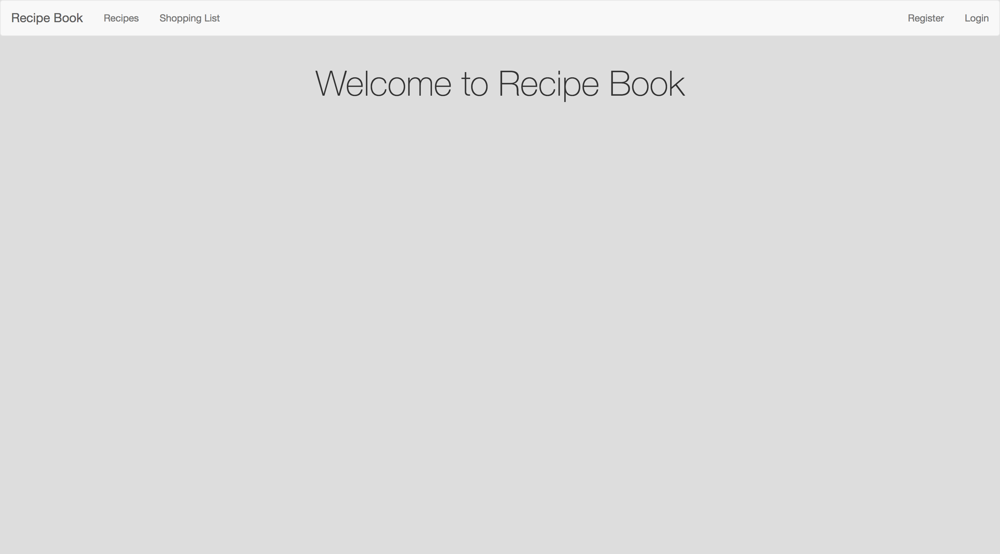
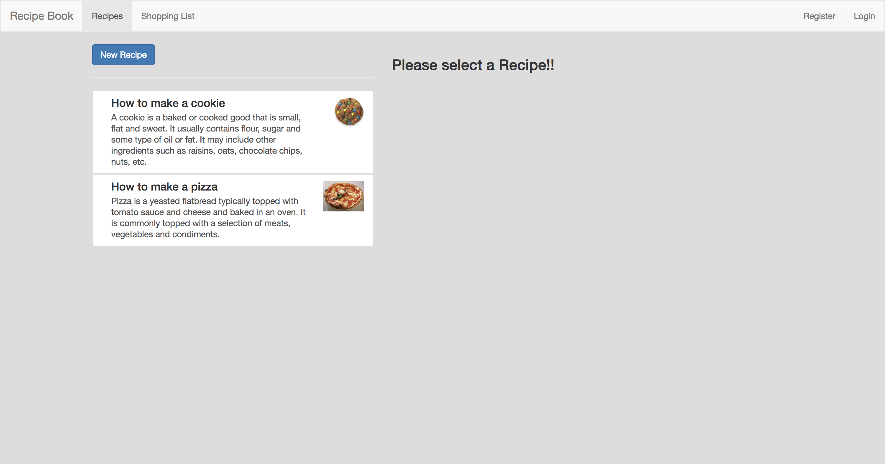
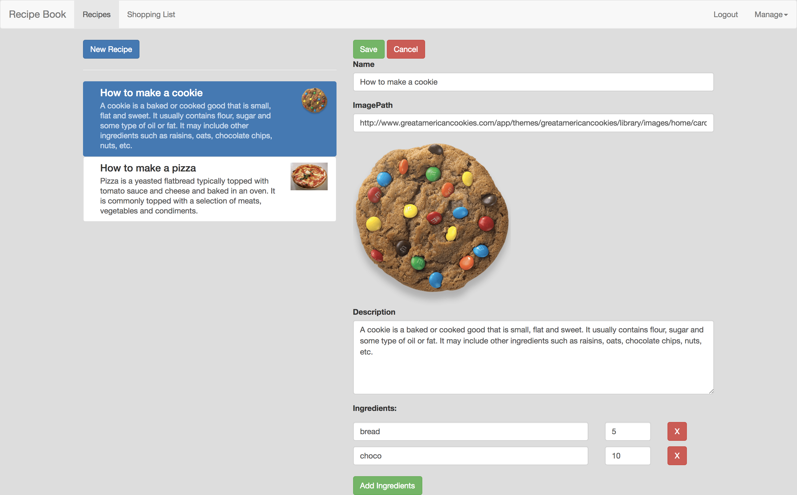
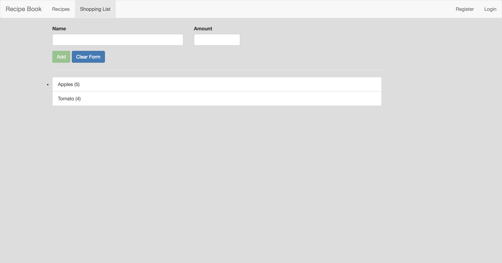

# Recipe

A simple recipe book app built using AngularJS. It stores recipes of user and his/her shopping list. It uses Firebase for authentication and Database.

### ScreenShots of App

<p align="center">


</p>
<br/><br/>
<p align="center">

<br/>
</p>
<br/><br/>
<p align="center">

<br/>
</p>
<br/>
<br/>


### Steps to run the project

Fork the repository and clone it on your machine.
To download all dependencies run:

```bash
npm install --dev
```


#### Run on Development server

Run project on localhost:

```bash
ng serve
``` 
Navigate to `http://localhost:4200/`.

#### Build

To build project run:

```bash
ng build
```

